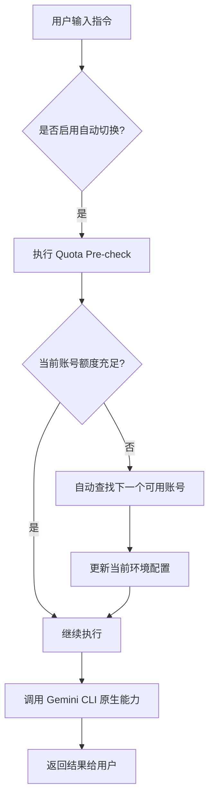

# 告别配额焦虑：手把手教你用 gcam 实现 Gemini 多账号自动切换


作为一名开发者，在使用 Google 的 Gemini API 时，最痛苦的莫过于在关键时刻看到那行冷冰冰的 `429 Too Many Requests`。尤其是在使用官方的 `gemini-cli` 进行深度调研或代码生成时，免费额度的限制总是让人如鲠在喉。

虽然我们可以申请多个 API Key，但手动切换账号、更新环境变量、还要时刻记得哪个账号还有额度，这本身就是一种巨大的心智负担。为了彻底解决这个问题，我开发了 **gcam (Gemini CLI Account Manager)** —— 一个专为 `gemini-cli` 设计的多账号管理与自动切换工具。

## 为什么需要 gcam？

在 gcam 出现之前，如果你想换个号继续白嫖，流程通常是这样的：
1. 发现当前账号额度用光。
2. 打开浏览器，登录另一个 Google 账号。
3. 复制 API Key。
4. 在终端执行 `export GEMINI_API_KEY=xxxx`。
5. 重新运行命令。

这种重复劳动在 AI 辅助开发的快节奏中显得格外的刺耳。gcam 的初衷就是让这个过程**自动化、透明化**。

## 整体架构：做最懂你的中间人

gcam 并不是要替代 `gemini-cli`，而是作为一个“智能中间层”存在。它负责在 `gemini-cli` 真正发出请求之前，先去检查一下配额，如果发现当前账号快挂了，就自动帮你换上“备胎”。


通过上面的架构图可以看到，gcam 就像是一个精密的网关。它管理着你的多组配置，并与 Gemini API 进行轻量级的通信以获取状态。

### 核心工作流

我们可以通过这个 Mermaid 流程图直观地感受一下 gcam 是如何工作的：



## 技术选型：从 Python 到 Go 的华丽转身

你可能会问，上游项目（Gemini-CLI-Auth-Manager）使用的是 Python，为什么 gcam 要选择使用 Go 重新实现？

其实，最初我也考虑过使用 Python，但作为一名 CLI 工具的狂热爱好者，我有几个无法妥协的理由：

1.  **零依赖，分发即用**：Python 项目往往需要用户安装解释器、配置 `venv`、还要处理 `pip install` 的报错。而 Go 可以编译成一个纯净的静态二进制文件，下载下来就能跑。
2.  **极致的启动速度**：对于 CLI 工具来说，毫秒级的响应差异都会影响手感。Go 的启动速度和执行效率，让 gcam 的钩子检查几乎感觉不到延迟。
3.  **跨平台兼容性**：Go 交叉编译非常方便，我可以在一个 CI 流程中同时发布 Linux, macOS 和 Windows 的全平台包，用户甚至不需要配置环境。

## 快速入门：3 分钟配置

安装 gcam 非常简单。如果你有 Go 环境：
```bash
go install github.com/dong4j/gemini-cli-account-manager/cmd/gcam@latest
```
或者直接从 [Release 页面](https://github.com/dong4j/gemini-cli-account-manager/releases) 下载对应平台的二进制文件。

### 初始化你的账号池
gcam 提供了交互式的菜单，你不需要去手动编辑复杂的 JSON。

```bash
gcam config add
```
按照提示输入你的 Account Name 和 API Key，重复几次，你就拥有了一个属于自己的“账号池”。

## 高阶用法：实现“无限额度”的错觉

gcam 最强大的地方在于它的 `hook` 功能。通过将 gcam 挂载到 `gemini-cli` 的生命周期中，你可以实现完全无感的切换。

### 自动重试与切换
当你配置好多个账号后，可以使用以下命令：
```bash
gcam hook --auto-switch
```
它会检查当前选中的账号是否有剩余额度。如果没有，它会自动寻找下一个并静默切换。

## 关键实现细节

gcam 内部大量使用了交互式 UI 库来提升用户体验。例如，账号切换菜单是基于 `survey` 库实现的，这让终端操作像图形界面一样直观。

### 代码片段：智能配额预检
这里展示一段简化后的预检逻辑，它是如何根据 API 返回的错误或剩余额度来决定是否切换的：

```go
// 核心切换逻辑片段
func (am *AccountManager) EnsureAvailable() error {
    account := am.GetCurrentAccount()
    quota, err := am.CheckQuota(account)
    
    if err != nil || quota.Remaining <= 0 {
        fmt.Printf("⚠️ 账号 %s 额度不足，正在尝试切换...\n", account.Name)
        next, err := am.FindNextAvailable()
        if err != nil {
            return fmt.Errorf("所有账号额度均已耗尽")
        }
        return am.SwitchTo(next)
    }
    return nil
}
```

## 写在最后

感谢上游项目 [Gemini-CLI-Auth-Manager](https://github.com/rtk-ai/Gemini-CLI-Auth-Manager) 提供的灵感和原型参考。gcam 在此基础上，通过 Go 语言的特性，将其转化为了一个更加稳定、易用且便携的工具。

如果你也深受 Gemini 配额之苦，不妨试试 gcam，让它成为你 AI 开发之路上的强力助推器。

---

**项目地址**: [github.com/dong4j/gemini-cli-account-manager](https://github.com/dong4j/gemini-cli-account-manager)

欢迎 Star / Issue / PR！

<span class="meta">Version: v1.0.0</span>
